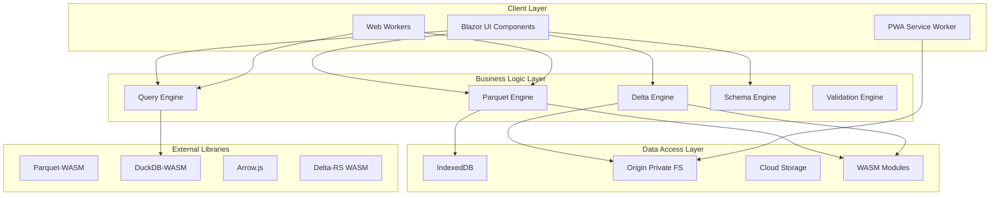

# Parquet & Delta Lake Tool - Complete Implementation Specification

**Document Control**
- Version: 1.0.0
- Document Type: Technical Implementation Specification
- Target Audience: Development Team
- Technology Stack: Blazor WebAssembly, .NET 8

## Table of Contents

1. [System Architecture](#1-system-architecture)
2. [Data Models](#2-data-models)
3. [API Specifications](#3-api-specifications)
4. [UI Components Specification](#4-ui-components-specification)
5. [Service Layer Implementation](#5-service-layer-implementation)
6. [JavaScript Interop Modules](#6-javascript-interop-modules)
7. [Testing Specifications](#7-testing-specifications)
8. [Deployment Configuration](#8-deployment-configuration)
9. [Security Specifications](#9-security-specifications)
10. [Monitoring and Observability](#10-monitoring-and-observability)
11. [Complete Package Configuration](#11-complete-package-configuration)
12. [Implementation Checklist](#12-implementation-checklist)

---

## 1. System Architecture

### 1.1 High-Level Architecture



### 1.2 Component Architecture

```csharp
namespace ParquetDeltaTool.Core
{
    public interface IFileProcessor
    {
        Task<FileMetadata> LoadFileAsync(Stream fileStream, FileFormat format);
        Task<DataPreview> GetPreviewAsync(int rows, int offset);
        Task<Schema> GetSchemaAsync();
        Task<Statistics> GetStatisticsAsync();
    }

    public interface IQueryEngine
    {
        Task<QueryResult> ExecuteQueryAsync(string sql, QueryOptions options);
        Task<QueryPlan> GetQueryPlanAsync(string sql);
        Task<ValidationResult> ValidateQueryAsync(string sql);
    }

    public interface ISchemaManager
    {
        Task<SchemaValidation> ValidateSchemaAsync(Schema schema);
        Task<SchemaEvolution> GetEvolutionPathAsync(Schema from, Schema to);
        Task<Schema> ConvertSchemaAsync(SchemaFormat from, SchemaFormat to);
    }

    public interface IDeltaOperations
    {
        Task<DeltaTable> LoadTableAsync(string path);
        Task<TransactionLog> GetHistoryAsync(int version);
        Task<OptimizeResult> OptimizeAsync(OptimizeOptions options);
        Task<VacuumResult> VacuumAsync(int retentionHours);
    }
}
```

### 1.3 Module Dependencies

```json
{
  "modules": {
    "core": {
      "dependencies": []
    },
    "parquet-processor": {
      "dependencies": ["core", "parquet-wasm", "arrow-js"]
    },
    "delta-processor": {
      "dependencies": ["core", "delta-rs-wasm", "parquet-processor"]
    },
    "query-engine": {
      "dependencies": ["core", "duckdb-wasm"]
    },
    "schema-manager": {
      "dependencies": ["core"]
    },
    "ui-components": {
      "dependencies": ["core", "mudblazor"]
    },
    "storage-manager": {
      "dependencies": ["core", "blazor-indexeddb"]
    },
    "cloud-connectors": {
      "dependencies": ["core", "aws-sdk", "azure-storage", "gcs-client"]
    }
  }
}
```

---

## 2. Data Models

### 2.1 Core Data Structures

```csharp
namespace ParquetDeltaTool.Models
{
    public class FileMetadata
    {
        public Guid FileId { get; set; }
        public string FileName { get; set; }
        public long FileSize { get; set; }
        public FileFormat Format { get; set; }
        public DateTime CreatedAt { get; set; }
        public DateTime ModifiedAt { get; set; }
        public string CreatedBy { get; set; }
        public Dictionary<string, string> Properties { get; set; }
        public CompressionType Compression { get; set; }
        public EncryptionInfo Encryption { get; set; }
    }

    public class ParquetFileMetadata : FileMetadata
    {
        public int RowGroups { get; set; }
        public long RowCount { get; set; }
        public List<RowGroupMetadata> RowGroupMetadata { get; set; }
        public List<ColumnMetadata> Columns { get; set; }
        public ParquetVersion Version { get; set; }
        public Dictionary<string, byte[]> KeyValueMetadata { get; set; }
    }

    public class DeltaTableMetadata : FileMetadata
    {
        public long Version { get; set; }
        public string TableId { get; set; }
        public List<string> PartitionColumns { get; set; }
        public DeltaProtocol Protocol { get; set; }
        public List<DeltaAction> History { get; set; }
        public TableProperties Properties { get; set; }
        public List<Constraint> Constraints { get; set; }
    }

    public class Schema
    {
        public string Name { get; set; }
        public List<Field> Fields { get; set; }
        public SchemaVersion Version { get; set; }
        public Dictionary<string, string> Metadata { get; set; }
    }

    public class Field
    {
        public string Name { get; set; }
        public DataType DataType { get; set; }
        public bool IsNullable { get; set; }
        public object DefaultValue { get; set; }
        public Dictionary<string, string> Metadata { get; set; }
        public List<Field> Children { get; set; } // For nested types
        public LogicalType LogicalType { get; set; }
        public PhysicalType PhysicalType { get; set; }
        public int DefinitionLevel { get; set; }
        public int RepetitionLevel { get; set; }
    }

    public class DataType
    {
        public TypeCategory Category { get; set; }
        public int? Precision { get; set; }
        public int? Scale { get; set; }
        public int? Length { get; set; }
        public TimeUnit? TimeUnit { get; set; }
        public bool IsAdjustedToUTC { get; set; }
    }

    public enum TypeCategory
    {
        Boolean, Int8, Int16, Int32, Int64,
        UInt8, UInt16, UInt32, UInt64,
        Float, Double, Decimal,
        String, Binary, FixedSizeBinary,
        Date, Time, Timestamp,
        List, Map, Struct, Union
    }

    public class RowGroupMetadata
    {
        public int Index { get; set; }
        public long RowCount { get; set; }
        public long TotalByteSize { get; set; }
        public List<ColumnChunkMetadata> ColumnChunks { get; set; }
        public long FileOffset { get; set; }
        public long TotalCompressedSize { get; set; }
        public int Ordinal { get; set; }
    }

    public class ColumnChunkMetadata
    {
        public string ColumnPath { get; set; }
        public long FileOffset { get; set; }
        public long CompressedSize { get; set; }
        public long UncompressedSize { get; set; }
        public long NumValues { get; set; }
        public Statistics Statistics { get; set; }
        public Encoding Encoding { get; set; }
        public CompressionType Compression { get; set; }
    }

    public class Statistics
    {
        public object Min { get; set; }
        public object Max { get; set; }
        public long NullCount { get; set; }
        public long DistinctCount { get; set; }
        public double? Mean { get; set; }
        public double? StandardDeviation { get; set; }
        public Dictionary<string, long> ValueCounts { get; set; }
        public List<Percentile> Percentiles { get; set; }
    }

    public class QueryResult
    {
        public Guid QueryId { get; set; }
        public List<Column> Columns { get; set; }
        public List<Row> Rows { get; set; }
        public long TotalRows { get; set; }
        public long ReturnedRows { get; set; }
        public TimeSpan ExecutionTime { get; set; }
        public long BytesScanned { get; set; }
        public long BytesReturned { get; set; }
        public QueryPlan Plan { get; set; }
        public List<Warning> Warnings { get; set; }
    }

    public class DeltaAction
    {
        public ActionType Type { get; set; }
        public long Version { get; set; }
        public DateTime Timestamp { get; set; }
        public string Operation { get; set; }
        public Dictionary<string, object> Parameters { get; set; }
        public DeltaActionDetails Details { get; set; }
    }

    public enum ActionType
    {
        Add, Remove, Metadata, Protocol, Txn, Cdc
    }
}
```

### 2.2 Configuration Models

```csharp
namespace ParquetDeltaTool.Configuration
{
    public class ApplicationSettings
    {
        public PerformanceSettings Performance { get; set; }
        public StorageSettings Storage { get; set; }
        public UISettings UI { get; set; }
        public SecuritySettings Security { get; set; }
        public CloudSettings Cloud { get; set; }
    }

    public class PerformanceSettings
    {
        public int MaxConcurrentOperations { get; set; } = 4;
        public long MaxMemoryUsageMB { get; set; } = 512;
        public int ChunkSizeKB { get; set; } = 1024;
        public int VirtualScrollBufferRows { get; set; } = 100;
        public bool UseWebWorkers { get; set; } = true;
        public int WebWorkerPoolSize { get; set; } = 4;
        public int QueryTimeoutSeconds { get; set; } = 30;
        public int CacheExpirationMinutes { get; set; } = 60;
    }

    public class StorageSettings
    {
        public long MaxFileSizeMB { get; set; } = 500;
        public long MaxIndexedDBSizeMB { get; set; } = 1024;
        public bool UseOPFS { get; set; } = true;
        public long OPFSQuotaMB { get; set; } = 5120;
        public int MaxRecentFiles { get; set; } = 20;
        public bool CompressCache { get; set; } = true;
    }

    public class UISettings
    {
        public Theme DefaultTheme { get; set; } = Theme.Auto;
        public LayoutMode DefaultLayout { get; set; } = LayoutMode.ThreePanel;
        public int DefaultPreviewRows { get; set; } = 100;
        public bool ShowAdvancedFeatures { get; set; } = false;
        public List<string> PinnedTools { get; set; }
        public Dictionary<string, object> UserPreferences { get; set; }
    }
}
```

---

## 3. API Specifications

### 3.1 File Processing API

```csharp
namespace ParquetDeltaTool.API
{
    [ApiController]
    [Route("api/[controller]")]
    public class FileController : ControllerBase
    {
        private readonly IFileProcessor _processor;

        [HttpPost("upload")]
        public async Task<ActionResult<FileUploadResponse>> UploadFile(
            [FromForm] IFormFile file,
            [FromQuery] ProcessingOptions options)
        {
            // Implementation details
            var validationResult = ValidateFile(file);
            if (!validationResult.IsValid)
                return BadRequest(validationResult.Errors);

            using var stream = file.OpenReadStream();
            var metadata = await _processor.LoadFileAsync(stream, options.Format);
            
            return Ok(new FileUploadResponse
            {
                FileId = metadata.FileId,
                Metadata = metadata,
                ProcessingTime = stopwatch.Elapsed
            });
        }

        [HttpGet("{fileId}/preview")]
        public async Task<ActionResult<DataPreview>> GetPreview(
            Guid fileId,
            [FromQuery] int rows = 100,
            [FromQuery] int offset = 0,
            [FromQuery] string columns = null)
        {
            var preview = await _processor.GetPreviewAsync(fileId, new PreviewOptions
            {
                Rows = rows,
                Offset = offset,
                Columns = columns?.Split(','),
                IncludeStatistics = true
            });

            return Ok(preview);
        }

        [HttpGet("{fileId}/schema")]
        public async Task<ActionResult<Schema>> GetSchema(
            Guid fileId,
            [FromQuery] SchemaFormat format = SchemaFormat.Native)
        {
            var schema = await _processor.GetSchemaAsync(fileId);
            
            if (format != SchemaFormat.Native)
            {
                schema = await _schemaManager.ConvertSchemaAsync(
                    schema, SchemaFormat.Native, format);
            }

            return Ok(schema);
        }

        [HttpPost("{fileId}/query")]
        public async Task<ActionResult<QueryResult>> ExecuteQuery(
            Guid fileId,
            [FromBody] QueryRequest request)
        {
            var validationResult = await _queryEngine.ValidateQueryAsync(request.Sql);
            if (!validationResult.IsValid)
                return BadRequest(validationResult.Errors);

            var result = await _queryEngine.ExecuteQueryAsync(
                fileId, 
                request.Sql, 
                request.Options);

            return Ok(result);
        }
    }

    public class ProcessingOptions
    {
        public FileFormat Format { get; set; }
        public bool InferSchema { get; set; } = true;
        public bool ComputeStatistics { get; set; } = true;
        public bool ValidateData { get; set; } = false;
        public int? PreviewRows { get; set; }
        public StorageMode StorageMode { get; set; } = StorageMode.Memory;
    }

    public class PreviewOptions
    {
        public int Rows { get; set; } = 100;
        public int Offset { get; set; } = 0;
        public string[] Columns { get; set; }
        public bool IncludeStatistics { get; set; } = false;
        public bool IncludeNulls { get; set; } = true;
        public SamplingStrategy Sampling { get; set; } = SamplingStrategy.First;
    }
}
```

### 3.2 Delta Lake Operations API

```csharp
namespace ParquetDeltaTool.API
{
    [ApiController]
    [Route("api/delta")]
    public class DeltaController : ControllerBase
    {
        private readonly IDeltaOperations _deltaOps;

        [HttpGet("{tableId}/history")]
        public async Task<ActionResult<List<DeltaAction>>> GetHistory(
            Guid tableId,
            [FromQuery] int? fromVersion = null,
            [FromQuery] int? toVersion = null,
            [FromQuery] int limit = 100)
        {
            var history = await _deltaOps.GetHistoryAsync(tableId, new HistoryOptions
            {
                FromVersion = fromVersion,
                ToVersion = toVersion,
                Limit = limit,
                IncludeDetails = true
            });

            return Ok(history);
        }

        [HttpPost("{tableId}/timetravel")]
        public async Task<ActionResult<DataPreview>> TimeTravel(
            Guid tableId,
            [FromBody] TimeTravelRequest request)
        {
            var snapshot = await _deltaOps.GetSnapshotAsync(
                tableId, 
                request.Version ?? request.Timestamp);

            var preview = await _deltaOps.GetPreviewAsync(
                snapshot, 
                request.PreviewOptions);

            return Ok(preview);
        }

        [HttpPost("{tableId}/optimize")]
        public async Task<ActionResult<OptimizeResult>> Optimize(
            Guid tableId,
            [FromBody] OptimizeRequest request)
        {
            var result = await _deltaOps.OptimizeAsync(tableId, new OptimizeOptions
            {
                TargetSizeMB = request.TargetSizeMB ?? 128,
                MaxConcurrent = request.MaxConcurrent ?? 4,
                ZOrderColumns = request.ZOrderColumns,
                CompactionStrategy = request.Strategy,
                DryRun = request.DryRun
            });

            return Ok(result);
        }

        [HttpPost("{tableId}/vacuum")]
        public async Task<ActionResult<VacuumResult>> Vacuum(
            Guid tableId,
            [FromBody] VacuumRequest request)
        {
            if (request.RetentionHours < 168 && !request.Force)
            {
                return BadRequest("Retention must be at least 7 days unless forced");
            }

            var result = await _deltaOps.VacuumAsync(
                tableId, 
                request.RetentionHours,
                request.DryRun);

            return Ok(result);
        }

        [HttpPost("{tableId}/restore")]
        public async Task<ActionResult<RestoreResult>> Restore(
            Guid tableId,
            [FromBody] RestoreRequest request)
        {
            var result = await _deltaOps.RestoreAsync(
                tableId,
                request.TargetVersion,
                request.CreateBackup);

            return Ok(result);
        }
    }
}
```

### 3.3 Schema Management API

```csharp
namespace ParquetDeltaTool.API
{
    [ApiController]
    [Route("api/schema")]
    public class SchemaController : ControllerBase
    {
        [HttpPost("validate")]
        public async Task<ActionResult<ValidationResult>> ValidateSchema(
            [FromBody] Schema schema,
            [FromQuery] ValidationLevel level = ValidationLevel.Standard)
        {
            var result = await _schemaManager.ValidateSchemaAsync(schema, new ValidationOptions
            {
                Level = level,
                CheckCompatibility = true,
                ValidateConstraints = true,
                ValidateLogicalTypes = true
            });

            return Ok(result);
        }

        [HttpPost("evolution")]
        public async Task<ActionResult<EvolutionAnalysis>> AnalyzeEvolution(
            [FromBody] EvolutionRequest request)
        {
            var analysis = await _schemaManager.AnalyzeEvolutionAsync(
                request.FromSchema,
                request.ToSchema);

            return Ok(new EvolutionAnalysis
            {
                IsBackwardCompatible = analysis.IsBackwardCompatible,
                IsForwardCompatible = analysis.IsForwardCompatible,
                BreakingChanges = analysis.BreakingChanges,
                Migrations = analysis.SuggestedMigrations,
                ImpactAssessment = analysis.ImpactAssessment
            });
        }

        [HttpPost("convert")]
        public async Task<ActionResult<ConversionResult>> ConvertSchema(
            [FromBody] ConversionRequest request)
        {
            var result = await _schemaManager.ConvertSchemaAsync(
                request.Schema,
                request.FromFormat,
                request.ToFormat,
                request.Options);

            return Ok(result);
        }

        [HttpPost("generate")]
        public async Task<ActionResult<Schema>> GenerateSchema(
            [FromBody] GenerateSchemaRequest request)
        {
            Schema schema;

            switch (request.Source)
            {
                case SchemaSource.SampleData:
                    schema = await _schemaManager.InferFromDataAsync(request.SampleData);
                    break;
                case SchemaSource.SqlDdl:
                    schema = await _schemaManager.ParseFromDdlAsync(request.Ddl);
                    break;
                case SchemaSource.JsonSchema:
                    schema = await _schemaManager.ConvertFromJsonSchemaAsync(request.JsonSchema);
                    break;
                default:
                    return BadRequest("Invalid schema source");
            }

            return Ok(schema);
        }
    }
}
```

---

## 4. UI Components Specification

### 4.1 Component Library Structure

```typescript
// Component hierarchy
interface ComponentLibrary {
    Layout: {
        MainLayout: LayoutComponent;
        NavigatorPanel: PanelComponent;
        InspectorPanel: PanelComponent;
        StatusBar: StatusComponent;
        CommandBar: CommandComponent;
    };
    
    DataViewer: {
        DataGrid: GridComponent;
        TreeView: TreeComponent;
        JsonViewer: ViewerComponent;
        HexViewer: ViewerComponent;
        SchemaVisualizer: VisualizerComponent;
    };
    
    Editors: {
        QueryEditor: EditorComponent;
        SchemaDesigner: DesignerComponent;
        FilterBuilder: BuilderComponent;
        TransformEditor: EditorComponent;
    };
    
    Visualizations: {
        StatisticsChart: ChartComponent;
        DistributionPlot: PlotComponent;
        TimelineView: TimelineComponent;
        DependencyGraph: GraphComponent;
    };
    
    Dialogs: {
        FileUploadDialog: DialogComponent;
        ExportDialog: DialogComponent;
        SettingsDialog: DialogComponent;
        ConfirmationDialog: DialogComponent;
    };
}
```

### 4.2 Blazor Component Implementation

```razor
@* DataGrid.razor *@
@namespace ParquetDeltaTool.Components
@inherits DataGridBase

<div class="data-grid-container @CssClass">
    <div class="grid-toolbar">
        <div class="toolbar-left">
            <button @onclick="ToggleColumnSelector">
                <i class="fas fa-columns"></i> Columns
            </button>
            <button @onclick="ExportSelected" disabled="@(!HasSelection)">
                <i class="fas fa-download"></i> Export
            </button>
            <div class="search-box">
                <input type="text" @bind="SearchText" @bind:event="oninput" 
                       placeholder="Search..." />
            </div>
        </div>
        <div class="toolbar-right">
            <span class="row-info">
                @if (IsFiltered)
                {
                    <span>@FilteredRows of @TotalRows rows</span>
                }
                else
                {
                    <span>@TotalRows rows</span>
                }
            </span>
            <button @onclick="RefreshData">
                <i class="fas fa-sync @(IsLoading ? "fa-spin" : "")"></i>
            </button>
        </div>
    </div>

    <div class="grid-header" @ref="headerElement">
        <div class="grid-row header-row">
            @if (ShowRowNumbers)
            {
                <div class="grid-cell row-number-cell">#</div>
            }
            @foreach (var column in VisibleColumns)
            {
                <div class="grid-cell header-cell @GetHeaderClass(column)"
                     @onclick="() => SortByColumn(column)"
                     @oncontextmenu="(e) => ShowColumnMenu(e, column)"
                     @oncontextmenu:preventDefault="true">
                    
                    <span class="column-name">@column.Name</span>
                    <span class="column-type">@column.DataType</span>
                    
                    @if (column.IsSorted)
                    {
                        <i class="fas fa-sort-@(column.SortDirection.ToLower())"></i>
                    }
                    
                    @if (column.IsFiltered)
                    {
                        <i class="fas fa-filter filter-active"></i>
                    }
                </div>
            }
        </div>
    </div>

    <div class="grid-body" @ref="bodyElement" 
         @onscroll="OnScroll"
         style="height: @(Height)px">
         
        <div class="virtual-scroller" 
             style="height: @(VirtualHeight)px; 
                    padding-top: @(ScrollOffset)px">
            
            @foreach (var row in VisibleRows)
            {
                <div class="grid-row @GetRowClass(row)"
                     @onclick="() => SelectRow(row)"
                     @ondblclick="() => OpenRowDetails(row)">
                    
                    @if (ShowRowNumbers)
                    {
                        <div class="grid-cell row-number-cell">
                            @row.Index
                        </div>
                    }
                    
                    @foreach (var column in VisibleColumns)
                    {
                        <div class="grid-cell @GetCellClass(row, column)"
                             @onclick:stopPropagation="true"
                             @onclick="() => SelectCell(row, column)">
                            @RenderCell(row, column)
                        </div>
                    }
                </div>
            }
        </div>
    </div>

    @if (ShowColumnSelector)
    {
        <ColumnSelector Columns="AllColumns"
                       VisibleColumns="VisibleColumns"
                       OnColumnsChanged="UpdateVisibleColumns" />
    }

    @if (ShowFilterPanel)
    {
        <FilterPanel Column="@ActiveFilterColumn"
                    OnFilterApplied="ApplyFilter"
                    OnFilterCleared="ClearFilter" />
    }
</div>

@code {
    [Parameter] public DataSource Data { get; set; }
    [Parameter] public int Height { get; set; } = 600;
    [Parameter] public bool ShowRowNumbers { get; set; } = true;
    [Parameter] public bool AllowMultiSelect { get; set; } = true;
    [Parameter] public bool VirtualScrolling { get; set; } = true;
    [Parameter] public EventCallback<RowSelection> OnSelectionChanged { get; set; }
    
    private ElementReference headerElement;
    private ElementReference bodyElement;
    private List<Column> VisibleColumns = new();
    private List<Row> VisibleRows = new();
    private int VirtualHeight;
    private int ScrollOffset;
    private bool IsLoading;
    private string SearchText;
    
    protected override async Task OnInitializedAsync()
    {
        await LoadDataAsync();
        InitializeVirtualScroller();
    }
    
    private async Task LoadDataAsync()
    {
        IsLoading = true;
        StateHasChanged();
        
        try
        {
            // Load data implementation
            await Data.LoadAsync();
            VisibleColumns = Data.Columns.Where(c => c.IsVisible).ToList();
            UpdateVisibleRows();
        }
        finally
        {
            IsLoading = false;
            StateHasChanged();
        }
    }
    
    private void InitializeVirtualScroller()
    {
        if (VirtualScrolling)
        {
            VirtualHeight = Data.RowCount * RowHeight;
            var viewportRows = Height / RowHeight;
            BufferSize = viewportRows * 3;
        }
    }
    
    private async Task OnScroll()
    {
        if (!VirtualScrolling) return;
        
        var scrollTop = await GetScrollTop(bodyElement);
        var startIndex = (int)(scrollTop / RowHeight);
        var endIndex = startIndex + BufferSize;
        
        ScrollOffset = startIndex * RowHeight;
        VisibleRows = Data.GetRows(startIndex, endIndex - startIndex);
        StateHasChanged();
    }
    
    private MarkupString RenderCell(Row row, Column column)
    {
        var value = row.GetValue(column);
        
        if (value == null)
        {
            return new MarkupString("<span class='null-value'>NULL</span>");
        }
        
        return column.DataType switch
        {
            DataType.Nested => RenderNestedValue(value),
            DataType.Binary => RenderBinaryValue(value),
            DataType.Date => RenderDateValue(value),
            DataType.Boolean => RenderBooleanValue(value),
            _ => new MarkupString(HtmlEncoder.Default.Encode(value.ToString()))
        };
    }
}
```

### 4.3 State Management

```csharp
namespace ParquetDeltaTool.State
{
    public class ApplicationState
    {
        private readonly List<FileState> _openFiles = new();
        private readonly Dictionary<string, object> _globalState = new();
        public event EventHandler StateChanged;

        public FileState ActiveFile { get; private set; }
        public IReadOnlyList<FileState> OpenFiles => _openFiles.AsReadOnly();
        public UserPreferences Preferences { get; set; }
        public WorkspaceState Workspace { get; set; }

        public void OpenFile(FileMetadata metadata)
        {
            var fileState = new FileState
            {
                Id = Guid.NewGuid(),
                Metadata = metadata,
                OpenedAt = DateTime.UtcNow,
                ViewState = new ViewState()
            };

            _openFiles.Add(fileState);
            ActiveFile = fileState;
            NotifyStateChanged();
        }

        public void CloseFile(Guid fileId)
        {
            var file = _openFiles.FirstOrDefault(f => f.Id == fileId);
            if (file != null)
            {
                _openFiles.Remove(file);
                if (ActiveFile == file)
                {
                    ActiveFile = _openFiles.FirstOrDefault();
                }
                NotifyStateChanged();
            }
        }

        public void UpdateViewState(Guid fileId, Action<ViewState> update)
        {
            var file = _openFiles.FirstOrDefault(f => f.Id == fileId);
            if (file != null)
            {
                update(file.ViewState);
                NotifyStateChanged();
            }
        }

        private void NotifyStateChanged() => StateChanged?.Invoke(this, EventArgs.Empty);
    }

    public class FileState
    {
        public Guid Id { get; set; }
        public FileMetadata Metadata { get; set; }
        public DateTime OpenedAt { get; set; }
        public ViewState ViewState { get; set; }
        public QueryHistory QueryHistory { get; set; }
        public List<Annotation> Annotations { get; set; }
    }

    public class ViewState
    {
        public int ScrollTop { get; set; }
        public int ScrollLeft { get; set; }
        public List<string> VisibleColumns { get; set; }
        public Dictionary<string, SortDirection> SortColumns { get; set; }
        public List<Filter> ActiveFilters { get; set; }
        public Selection CurrentSelection { get; set; }
        public ViewMode Mode { get; set; }
        public Dictionary<string, bool> ExpandedNodes { get; set; }
    }
}
```

---

## 5. Service Layer Implementation

### 5.1 Parquet Processing Service

```csharp
namespace ParquetDeltaTool.Services
{
    public class ParquetProcessingService : IFileProcessor
    {
        private readonly ILogger<ParquetProcessingService> _logger;
        private readonly IStorageService _storage;
        private readonly IStatisticsService _statistics;
        private readonly IJSRuntime _jsRuntime;

        public async Task<FileMetadata> LoadFileAsync(Stream stream, FileFormat format)
        {
            try
            {
                // Invoke WASM module for Parquet parsing
                var moduleRef = await _jsRuntime.InvokeAsync<IJSObjectReference>(
                    "import", "./js/parquet-processor.js");

                // Convert stream to byte array for JS interop
                using var memoryStream = new MemoryStream();
                await stream.CopyToAsync(memoryStream);
                var bytes = memoryStream.ToArray();

                // Parse file metadata using WASM
                var jsMetadata = await moduleRef.InvokeAsync<object>(
                    "parseParquetMetadata", bytes);

                // Convert JS object to C# model
                var metadata = ConvertJsMetadata(jsMetadata);

                // Store in IndexedDB for future access
                await _storage.StoreFileAsync(metadata.FileId, bytes);

                // Compute statistics in background
                _ = Task.Run(async () =>
                {
                    var stats = await _statistics.ComputeStatisticsAsync(metadata.FileId);
                    metadata.Statistics = stats;
                    await _storage.UpdateMetadataAsync(metadata);
                });

                return metadata;
            }
            catch (Exception ex)
            {
                _logger.LogError(ex, "Failed to load Parquet file");
                throw new FileProcessingException("Failed to load file", ex);
            }
        }

        public async Task<DataPreview> GetPreviewAsync(int rows, int offset)
        {
            var moduleRef = await GetParquetModule();
            
            // Use Web Worker for large file processing
            if (await ShouldUseWebWorker())
            {
                return await GetPreviewViaWebWorker(rows, offset);
            }

            var preview = await moduleRef.InvokeAsync<DataPreview>(
                "readParquetData", 
                new { rows, offset, includeStats = true });

            return preview;
        }

        public async Task<Schema> GetSchemaAsync()
        {
            var moduleRef = await GetParquetModule();
            var jsSchema = await moduleRef.InvokeAsync<object>("getSchema");
            return ConvertJsSchema(jsSchema);
        }

        private async Task<bool> ShouldUseWebWorker()
        {
            var fileSize = await _storage.GetFileSizeAsync(CurrentFileId);
            return fileSize > 10 * 1024 * 1024; // 10MB threshold
        }

        private async Task<DataPreview> GetPreviewViaWebWorker(int rows, int offset)
        {
            var worker = await _jsRuntime.InvokeAsync<IJSObjectReference>(
                "createWorker", "./js/parquet-worker.js");

            try
            {
                var result = await worker.InvokeAsync<DataPreview>(
                    "processInWorker",
                    new { 
                        operation = "preview",
                        fileId = CurrentFileId,
                        rows,
                        offset
                    });

                return result;
            }
            finally
            {
                await worker.DisposeAsync();
            }
        }
    }
}
```

### 5.2 Query Engine Service

```csharp
namespace ParquetDeltaTool.Services
{
    public class QueryEngineService : IQueryEngine
    {
        private readonly IJSRuntime _jsRuntime;
        private readonly IStorageService _storage;
        private readonly ILogger<QueryEngineService> _logger;
        private IJSObjectReference _duckDbModule;

        public async Task InitializeAsync()
        {
            _duckDbModule = await _jsRuntime.InvokeAsync<IJSObjectReference>(
                "import", "./js/duckdb-wrapper.js");
            
            await _duckDbModule.InvokeVoidAsync("initialize");
        }

        public async Task<QueryResult> ExecuteQueryAsync(string sql, QueryOptions options)
        {
            try
            {
                // Register Parquet file with DuckDB
                await RegisterFileWithDuckDb(options.FileId);

                // Set query options
                await ConfigureQueryOptions(options);

                // Execute query with timeout
                using var cts = new CancellationTokenSource(
                    TimeSpan.FromSeconds(options.TimeoutSeconds ?? 30));

                var result = await _duckDbModule.InvokeAsync<object>(
                    "executeQuery",
                    cts.Token,
                    sql,
                    options.MaxRows ?? 10000);

                return ConvertQueryResult(result);
            }
            catch (TaskCanceledException)
            {
                throw new QueryTimeoutException($"Query exceeded timeout of {options.TimeoutSeconds} seconds");
            }
            catch (Exception ex)
            {
                _logger.LogError(ex, "Query execution failed: {Sql}", sql);
                throw new QueryExecutionException($"Query failed: {ex.Message}", ex);
            }
        }

        public async Task<QueryPlan> GetQueryPlanAsync(string sql)
        {
            var plan = await _duckDbModule.InvokeAsync<string>(
                "explainQuery", sql, "json");

            return JsonSerializer.Deserialize<QueryPlan>(plan);
        }

        public async Task<ValidationResult> ValidateQueryAsync(string sql)
        {
            try
            {
                // Parse and validate SQL syntax
                var parseResult = await _duckDbModule.InvokeAsync<object>(
                    "parseQuery", sql);

                // Check for security issues
                var securityCheck = ValidateQuerySecurity(sql);
                if (!securityCheck.IsValid)
                {
                    return securityCheck;
                }

                // Validate against schema
                var schemaValidation = await ValidateAgainstSchema(sql);

                return new ValidationResult
                {
                    IsValid = true,
                    Warnings = schemaValidation.Warnings
                };
            }
            catch (Exception ex)
            {
                return new ValidationResult
                {
                    IsValid = false,
                    Errors = new[] { ex.Message }
                };
            }
        }

        private ValidationResult ValidateQuerySecurity(string sql)
        {
            var forbidden = new[] { "DELETE", "DROP", "CREATE", "ALTER", "INSERT", "UPDATE" };
            var upperSql = sql.ToUpperInvariant();

            foreach (var keyword in forbidden)
            {
                if (upperSql.Contains(keyword))
                {
                    return new ValidationResult
                    {
                        IsValid = false,
                        Errors = new[] { $"Query contains forbidden keyword: {keyword}" }
                    };
                }
            }

            return new ValidationResult { IsValid = true };
        }

        private async Task RegisterFileWithDuckDb(Guid fileId)
        {
            var fileData = await _storage.GetFileDataAsync(fileId);
            await _duckDbModule.InvokeVoidAsync(
                "registerParquetFile", 
                fileId.ToString(), 
                fileData);
        }
    }
}
```

### 5.3 Storage Service

```csharp
namespace ParquetDeltaTool.Services
{
    public class StorageService : IStorageService
    {
        private readonly IJSRuntime _jsRuntime;
        private readonly ILogger<StorageService> _logger;
        private IJSObjectReference _indexedDbModule;
        private IJSObjectReference _opfsModule;

        public async Task InitializeAsync()
        {
            _indexedDbModule = await _jsRuntime.InvokeAsync<IJSObjectReference>(
                "import", "./js/storage/indexeddb.js");
            
            _opfsModule = await _jsRuntime.InvokeAsync<IJSObjectReference>(
                "import", "./js/storage/opfs.js");

            await _indexedDbModule.InvokeVoidAsync("initializeDatabase");
            
            if (await IsOPFSSupported())
            {
                await _opfsModule.InvokeVoidAsync("initialize");
            }
        }

        public async Task<Guid> StoreFileAsync(byte[] data, FileMetadata metadata)
        {
            var fileId = Guid.NewGuid();
            
            // Determine storage strategy based on file size
            if (data.Length > 50 * 1024 * 1024) // 50MB
            {
                if (await IsOPFSSupported())
                {
                    await StoreInOPFS(fileId, data);
                    metadata.StorageLocation = StorageLocation.OPFS;
                }
                else
                {
                    await StoreInChunks(fileId, data);
                    metadata.StorageLocation = StorageLocation.IndexedDBChunked;
                }
            }
            else
            {
                await StoreInIndexedDB(fileId, data);
                metadata.StorageLocation = StorageLocation.IndexedDB;
            }

            await StoreMetadata(fileId, metadata);
            return fileId;
        }

        private async Task StoreInOPFS(Guid fileId, byte[] data)
        {
            await _opfsModule.InvokeVoidAsync(
                "writeFile",
                fileId.ToString(),
                data);
        }

        private async Task StoreInIndexedDB(Guid fileId, byte[] data)
        {
            await _indexedDbModule.InvokeVoidAsync(
                "storeFile",
                new
                {
                    id = fileId.ToString(),
                    data = data,
                    timestamp = DateTimeOffset.UtcNow.ToUnixTimeMilliseconds()
                });
        }

        private async Task StoreInChunks(Guid fileId, byte[] data)
        {
            const int chunkSize = 1024 * 1024; // 1MB chunks
            var chunks = new List<byte[]>();
            
            for (int i = 0; i < data.Length; i += chunkSize)
            {
                var chunk = data.Skip(i).Take(Math.Min(chunkSize, data.Length - i)).ToArray();
                chunks.Add(chunk);
            }

            await _indexedDbModule.InvokeVoidAsync(
                "storeChunkedFile",
                new
                {
                    id = fileId.ToString(),
                    chunks = chunks,
                    totalSize = data.Length,
                    chunkSize = chunkSize
                });
        }

        public async Task<byte[]> GetFileDataAsync(Guid fileId)
        {
            var metadata = await GetMetadataAsync(fileId);
            
            return metadata.StorageLocation switch
            {
                StorageLocation.OPFS => await ReadFromOPFS(fileId),
                StorageLocation.IndexedDBChunked => await ReadChunkedFile(fileId),
                _ => await ReadFromIndexedDB(fileId)
            };
        }

        public async Task<long> GetStorageUsageAsync()
        {
            var indexedDbUsage = await _indexedDbModule.InvokeAsync<long>("getStorageUsage");
            var opfsUsage = await IsOPFSSupported() 
                ? await _opfsModule.InvokeAsync<long>("getStorageUsage") 
                : 0;

            return indexedDbUsage + opfsUsage;
        }

        public async Task CleanupOldFilesAsync(TimeSpan retention)
        {
            var cutoffTime = DateTimeOffset.UtcNow.Subtract(retention).ToUnixTimeMilliseconds();
            
            await _indexedDbModule.InvokeVoidAsync(
                "deleteFilesOlderThan", 
                cutoffTime);

            if (await IsOPFSSupported())
            {
                await _opfsModule.InvokeVoidAsync(
                    "cleanupOldFiles",
                    cutoffTime);
            }
        }

        private async Task<bool> IsOPFSSupported()
        {
            return await _jsRuntime.InvokeAsync<bool>("isOPFSSupported");
        }
    }
}
```

---

## 6. JavaScript Interop Modules

### 6.1 Parquet WASM Wrapper

```javascript
// parquet-processor.js
import * as parquetWasm from '@dsnp/parquetjs';

let wasmModule = null;

export async function initialize() {
    if (!wasmModule) {
        wasmModule = await parquetWasm.init();
    }
    return wasmModule;
}

export async function parseParquetMetadata(bytes) {
    await initialize();
    
    const reader = await parquetWasm.ParquetReader.openBuffer(bytes);
    const metadata = reader.getMetadata();
    const schema = reader.getSchema();
    
    return {
        version: metadata.version,
        createdBy: metadata.created_by,
        numRows: metadata.num_rows,
        rowGroups: metadata.row_groups.map(rg => ({
            numRows: rg.num_rows,
            totalByteSize: rg.total_byte_size,
            columns: rg.columns.map(col => ({
                name: col.name,
                compression: col.compression,
                encodings: col.encodings,
                compressedSize: col.compressed_size,
                uncompressedSize: col.uncompressed_size,
                statistics: col.statistics ? {
                    min: col.statistics.min,
                    max: col.statistics.max,
                    nullCount: col.statistics.null_count,
                    distinctCount: col.statistics.distinct_count
                } : null
            }))
        })),
        schema: convertSchema(schema),
        keyValueMetadata: metadata.key_value_metadata
    };
}

export async function readParquetData(bytes, options = {}) {
    await initialize();
    
    const { 
        rows = 100, 
        offset = 0, 
        columns = null,
        includeStats = false 
    } = options;
    
    const reader = await parquetWasm.ParquetReader.openBuffer(bytes);
    const cursor = reader.getCursor(columns);
    
    // Skip to offset
    for (let i = 0; i < offset && cursor.hasNext(); i++) {
        cursor.next();
    }
    
    const data = [];
    for (let i = 0; i < rows && cursor.hasNext(); i++) {
        data.push(cursor.next());
    }
    
    const result = {
        rows: data,
        schema: convertSchema(reader.getSchema()),
        totalRows: reader.getRowCount()
    };
    
    if (includeStats) {
        result.statistics = await computeStatistics(reader, columns);
    }
    
    await reader.close();
    return result;
}

function convertSchema(wasmSchema) {
    return {
        fields: wasmSchema.fields.map(field => ({
            name: field.name,
            type: field.type,
            nullable: field.nullable,
            metadata: field.metadata,
            children: field.fields ? convertSchema({ fields: field.fields }).fields : null,
            logicalType: field.logicalType,
            physicalType: field.physicalType,
            repetitionType: field.repetitionType,
            definitionLevel: field.definitionLevel
        }))
    };
}

async function computeStatistics(reader, columns) {
    const stats = {};
    const schema = reader.getSchema();
    const targetColumns = columns || schema.fields.map(f => f.name);
    
    for (const colName of targetColumns) {
        const columnStats = {
            nullCount: 0,
            distinctValues: new Set(),
            min: null,
            max: null
        };
        
        const cursor = reader.getCursor([colName]);
        while (cursor.hasNext()) {
            const row = cursor.next();
            const value = row[colName];
            
            if (value === null || value === undefined) {
                columnStats.nullCount++;
            } else {
                columnStats.distinctValues.add(JSON.stringify(value));
                
                if (columnStats.min === null || value < columnStats.min) {
                    columnStats.min = value;
                }
                if (columnStats.max === null || value > columnStats.max) {
                    columnStats.max = value;
                }
            }
        }
        
        stats[colName] = {
            nullCount: columnStats.nullCount,
            distinctCount: columnStats.distinctValues.size,
            min: columnStats.min,
            max: columnStats.max,
            nullPercentage: (columnStats.nullCount / reader.getRowCount()) * 100
        };
    }
    
    return stats;
}
```

### 6.2 DuckDB WASM Wrapper

```javascript
// duckdb-wrapper.js
import * as duckdb from '@duckdb/duckdb-wasm';

let db = null;
let conn = null;

export async function initialize() {
    if (!db) {
        const bundle = await duckdb.selectBundle();
        const worker = new Worker(bundle.mainWorker);
        const logger = new duckdb.ConsoleLogger();
        
        db = new duckdb.AsyncDuckDB(logger, worker);
        await db.instantiate(bundle.mainModule);
        conn = await db.connect();
    }
    return { db, conn };
}

export async function registerParquetFile(fileId, bytes) {
    await initialize();
    
    // Register file as a virtual table
    await conn.registerFileBuffer(
        `file_${fileId}.parquet`,
        new Uint8Array(bytes)
    );
    
    // Create a view for easier querying
    await conn.query(`
        CREATE OR REPLACE VIEW data AS 
        SELECT * FROM parquet_scan('file_${fileId}.parquet')
    `);
}

export async function executeQuery(sql, maxRows = 10000) {
    await initialize();
    
    const startTime = performance.now();
    
    try {
        // Add row limit if not present
        if (!sql.toLowerCase().includes('limit')) {
            sql = `${sql} LIMIT ${maxRows}`;
        }
        
        const result = await conn.query(sql);
        const executionTime = performance.now() - startTime;
        
        // Convert Arrow table to JSON
        const schema = result.schema;
        const batches = result.batches;
        
        const rows = [];
        for (const batch of batches) {
            for (let i = 0; i < batch.numRows; i++) {
                const row = {};
                for (const field of schema.fields) {
                    const column = batch.getChild(field.name);
                    row[field.name] = column?.get(i);
                }
                rows.push(row);
            }
        }
        
        return {
            columns: schema.fields.map(f => ({
                name: f.name,
                type: f.type.toString(),
                nullable: f.nullable
            })),
            rows: rows,
            rowCount: rows.length,
            executionTime: executionTime,
            bytesScanned: estimateBytesScanned(result)
        };
    } catch (error) {
        throw new Error(`Query execution failed: ${error.message}`);
    }
}

export async function explainQuery(sql, format = 'json') {
    await initialize();
    
    const explainSql = `EXPLAIN (FORMAT ${format}) ${sql}`;
    const result = await conn.query(explainSql);
    
    return result.toString();
}

export async function parseQuery(sql) {
    await initialize();
    
    try {
        // Use DuckDB's parser to validate syntax
        const statement = await conn.prepare(sql);
        await statement.close();
        
        return {
            valid: true,
            type: detectQueryType(sql)
        };
    } catch (error) {
        return {
            valid: false,
            error: error.message
        };
    }
}

function detectQueryType(sql) {
    const normalized = sql.trim().toUpperCase();
    
    if (normalized.startsWith('SELECT')) return 'SELECT';
    if (normalized.startsWith('WITH')) return 'CTE';
    if (normalized.startsWith('EXPLAIN')) return 'EXPLAIN';
    
    return 'UNKNOWN';
}

function estimateBytesScanned(result) {
    let bytes = 0;
    
    for (const batch of result.batches) {
        for (const field of result.schema.fields) {
            const column = batch.getChild(field.name);
            if (column) {
                bytes += column.byteLength || 0;
            }
        }
    }
    
    return bytes;
}

export async function analyzeTable(tableName) {
    await initialize();
    
    const stats = {};
    
    // Get table info
    const tableInfo = await conn.query(`
        SELECT column_name, data_type, is_nullable
        FROM information_schema.columns
        WHERE table_name = '${tableName}'
    `);
    
    // Get row count
    const countResult = await conn.query(`
        SELECT COUNT(*) as count FROM ${tableName}
    `);
    stats.rowCount = countResult.toArray()[0].count;
    
    // Get column statistics
    const columns = tableInfo.toArray();
    stats.columns = [];
    
    for (const col of columns) {
        const colStats = await conn.query(`
            SELECT 
                COUNT(DISTINCT "${col.column_name}") as distinct_count,
                COUNT(*) - COUNT("${col.column_name}") as null_count,
                MIN("${col.column_name}") as min_val,
                MAX("${col.column_name}") as max_val
            FROM ${tableName}
        `);
        
        const result = colStats.toArray()[0];
        stats.columns.push({
            name: col.column_name,
            type: col.data_type,
            nullable: col.is_nullable,
            distinctCount: result.distinct_count,
            nullCount: result.null_count,
            min: result.min_val,
            max: result.max_val
        });
    }
    
    return stats;
}
```

### 6.3 Storage Module

```javascript
// storage/indexeddb.js
const DB_NAME = 'ParquetDeltaTool';
const DB_VERSION = 1;
let db = null;

export async function initializeDatabase() {
    return new Promise((resolve, reject) => {
        const request = indexedDB.open(DB_NAME, DB_VERSION);
        
        request.onerror = () => reject(request.error);
        request.onsuccess = () => {
            db = request.result;
            resolve(db);
        };
        
        request.onupgradeneeded = (event) => {
            const database = event.target.result;
            
            // Files store
            if (!database.objectStoreNames.contains('files')) {
                const fileStore = database.createObjectStore('files', { 
                    keyPath: 'id' 
                });
                fileStore.createIndex('timestamp', 'timestamp', { unique: false });
                fileStore.createIndex('fileName', 'metadata.fileName', { unique: false });
            }
            
            // Chunks store for large files
            if (!database.objectStoreNames.contains('chunks')) {
                const chunkStore = database.createObjectStore('chunks', {
                    keyPath: ['fileId', 'chunkIndex']
                });
                chunkStore.createIndex('fileId', 'fileId', { unique: false });
            }
            
            // Metadata store
            if (!database.objectStoreNames.contains('metadata')) {
                const metadataStore = database.createObjectStore('metadata', {
                    keyPath: 'id'
                });
                metadataStore.createIndex('type', 'type', { unique: false });
            }
            
            // Query history
            if (!database.objectStoreNames.contains('queries')) {
                const queryStore = database.createObjectStore('queries', {
                    keyPath: 'id',
                    autoIncrement: true
                });
                queryStore.createIndex('fileId', 'fileId', { unique: false });
                queryStore.createIndex('timestamp', 'timestamp', { unique: false });
            }
        };
    });
}

export async function storeFile(file) {
    const transaction = db.transaction(['files'], 'readwrite');
    const store = transaction.objectStore('files');
    
    return new Promise((resolve, reject) => {
        const request = store.put(file);
        request.onsuccess = () => resolve(request.result);
        request.onerror = () => reject(request.error);
    });
}

export async function storeChunkedFile(fileData) {
    const { id, chunks, totalSize, chunkSize } = fileData;
    
    // Store file metadata
    await storeFile({
        id,
        type: 'chunked',
        totalSize,
        chunkSize,
        chunkCount: chunks.length,
        timestamp: Date.now()
    });
    
    // Store chunks
    const transaction = db.transaction(['chunks'], 'readwrite');
    const store = transaction.objectStore('chunks');
    
    for (let i = 0; i < chunks.length; i++) {
        await new Promise((resolve, reject) => {
            const request = store.put({
                fileId: id,
                chunkIndex: i,
                data: chunks[i]
            });
            request.onsuccess = () => resolve();
            request.onerror = () => reject(request.error);
        });
    }
}

export async function getFile(id) {
    const transaction = db.transaction(['files'], 'readonly');
    const store = transaction.objectStore('files');
    
    return new Promise((resolve, reject) => {
        const request = store.get(id);
        request.onsuccess = () => resolve(request.result);
        request.onerror = () => reject(request.error);
    });
}

export async function getChunkedFile(id) {
    const fileInfo = await getFile(id);
    
    if (fileInfo.type !== 'chunked') {
        return fileInfo.data;
    }
    
    const transaction = db.transaction(['chunks'], 'readonly');
    const store = transaction.objectStore('chunks');
    const index = store.index('fileId');
    
    return new Promise((resolve, reject) => {
        const request = index.getAll(id);
        request.onsuccess = () => {
            const chunks = request.result
                .sort((a, b) => a.chunkIndex - b.chunkIndex)
                .map(chunk => chunk.data);
            
            // Concatenate chunks
            const totalLength = chunks.reduce((sum, chunk) => sum + chunk.byteLength, 0);
            const result = new Uint8Array(totalLength);
            
            let offset = 0;
            for (const chunk of chunks) {
                result.set(new Uint8Array(chunk), offset);
                offset += chunk.byteLength;
            }
            
            resolve(result);
        };
        request.onerror = () => reject(request.error);
    });
}

export async function deleteFilesOlderThan(timestamp) {
    const transaction = db.transaction(['files', 'chunks'], 'readwrite');
    const fileStore = transaction.objectStore('files');
    const chunkStore = transaction.objectStore('chunks');
    const index = fileStore.index('timestamp');
    
    const range = IDBKeyRange.upperBound(timestamp);
    const request = index.openCursor(range);
    
    return new Promise((resolve, reject) => {
        const deletedIds = [];
        
        request.onsuccess = (event) => {
            const cursor = event.target.result;
            if (cursor) {
                deletedIds.push(cursor.value.id);
                
                // Delete file
                fileStore.delete(cursor.value.id);
                
                // Delete associated chunks
                const chunkIndex = chunkStore.index('fileId');
                const chunkRequest = chunkIndex.openCursor(IDBKeyRange.only(cursor.value.id));
                
                chunkRequest.onsuccess = (e) => {
                    const chunkCursor = e.target.result;
                    if (chunkCursor) {
                        chunkStore.delete([cursor.value.id, chunkCursor.value.chunkIndex]);
                        chunkCursor.continue();
                    }
                };
                
                cursor.continue();
            } else {
                resolve(deletedIds);
            }
        };
        
        request.onerror = () => reject(request.error);
    });
}

export async function getStorageUsage() {
    if ('storage' in navigator && 'estimate' in navigator.storage) {
        const estimate = await navigator.storage.estimate();
        return estimate.usage || 0;
    }
    
    // Fallback: calculate manually
    let totalSize = 0;
    
    const transaction = db.transaction(['files', 'chunks'], 'readonly');
    const fileStore = transaction.objectStore('files');
    const chunkStore = transaction.objectStore('chunks');
    
    // Calculate files size
    const files = await getAllFromStore(fileStore);
    for (const file of files) {
        if (file.data) {
            totalSize += file.data.byteLength || 0;
        } else if (file.totalSize) {
            totalSize += file.totalSize;
        }
    }
    
    return totalSize;
}

function getAllFromStore(store) {
    return new Promise((resolve, reject) => {
        const request = store.getAll();
        request.onsuccess = () => resolve(request.result);
        request.onerror = () => reject(request.error);
    });
}

export async function saveQueryHistory(query) {
    const transaction = db.transaction(['queries'], 'readwrite');
    const store = transaction.objectStore('queries');
    
    return new Promise((resolve, reject) => {
        const request = store.add({
            ...query,
            timestamp: Date.now()
        });
        request.onsuccess = () => resolve(request.result);
        request.onerror = () => reject(request.error);
    });
}

export async function getQueryHistory(fileId, limit = 50) {
    const transaction = db.transaction(['queries'], 'readonly');
    const store = transaction.objectStore('queries');
    const index = store.index('fileId');
    
    return new Promise((resolve, reject) => {
        const request = index.getAll(fileId);
        request.onsuccess = () => {
            const queries = request.result
                .sort((a, b) => b.timestamp - a.timestamp)
                .slice(0, limit);
            resolve(queries);
        };
        request.onerror = () => reject(request.error);
    });
}
```

---

## 7. Testing Specifications

### 7.1 Unit Test Structure

```csharp
namespace ParquetDeltaTool.Tests.Unit
{
    [TestClass]
    public class ParquetProcessingServiceTests
    {
        private Mock<IJSRuntime> _jsRuntimeMock;
        private Mock<IStorageService> _storageMock;
        private Mock<IStatisticsService> _statisticsMock;
        private ParquetProcessingService _service;

        [TestInitialize]
        public void Setup()
        {
            _jsRuntimeMock = new Mock<IJSRuntime>();
            _storageMock = new Mock<IStorageService>();
            _statisticsMock = new Mock<IStatisticsService>();
            
            _service = new ParquetProcessingService(
                Mock.Of<ILogger<ParquetProcessingService>>(),
                _storageMock.Object,
                _statisticsMock.Object,
                _jsRuntimeMock.Object);
        }

        [TestMethod]
        public async Task LoadFileAsync_ValidParquetFile_ReturnsMetadata()
        {
            // Arrange
            var testFile = TestDataGenerator.GenerateParquetFile();
            var stream = new MemoryStream(testFile);
            
            _jsRuntimeMock
                .Setup(x => x.InvokeAsync<IJSObjectReference>(
                    "import", 
                    It.IsAny<object[]>()))
                .ReturnsAsync(Mock.Of<IJSObjectReference>());

            // Act
            var result = await _service.LoadFileAsync(stream, FileFormat.Parquet);

            // Assert
            Assert.IsNotNull(result);
            Assert.AreEqual(FileFormat.Parquet, result.Format);
            _storageMock.Verify(x => x.StoreFileAsync(
                It.IsAny<Guid>(), 
                It.IsAny<byte[]>()), 
                Times.Once);
        }

        [TestMethod]
        [DataRow(0)]
        [DataRow(100)]
        [DataRow(10000)]
        public async Task GetPreviewAsync_VariousRowCounts_ReturnsCorrectNumberOfRows(int rows)
        {
            // Arrange
            _jsRuntimeMock
                .Setup(x => x.InvokeAsync<DataPreview>(
                    It.IsAny<string>(),
                    It.IsAny<object[]>()))
                .ReturnsAsync(new DataPreview 
                { 
                    Rows = new List<Row>(rows),
                    TotalRows = 10000 
                });

            // Act
            var result = await _service.GetPreviewAsync(rows, 0);

            // Assert
            Assert.AreEqual(Math.Min(rows, 10000), result.Rows.Count);
        }

        [TestMethod]
        public async Task LoadFileAsync_CorruptedFile_ThrowsFileProcessingException()
        {
            // Arrange
            var corruptedData = new byte[] { 0xFF, 0xFF, 0xFF };
            var stream = new MemoryStream(corruptedData);

            _jsRuntimeMock
                .Setup(x => x.InvokeAsync<object>(
                    It.IsAny<string>(),
                    It.IsAny<object[]>()))
                .ThrowsAsync(new Exception("Invalid Parquet file"));

            // Act & Assert
            await Assert.ThrowsExceptionAsync<FileProcessingException>(
                () => _service.LoadFileAsync(stream, FileFormat.Parquet));
        }
    }
}
```

### 7.2 Integration Tests

```csharp
namespace ParquetDeltaTool.Tests.Integration
{
    [TestClass]
    public class EndToEndTests
    {
        private WebApplicationFactory<Program> _factory;
        private HttpClient _client;

        [TestInitialize]
        public void Setup()
        {
            _factory = new WebApplicationFactory<Program>()
                .WithWebHostBuilder(builder =>
                {
                    builder.ConfigureServices(services =>
                    {
                        // Override services for testing
                        services.AddSingleton<IStorageService, InMemoryStorageService>();
                    });
                });

            _client = _factory.CreateClient();
        }

        [TestMethod]
        public async Task CompleteWorkflow_UploadQueryExport_Success()
        {
            // Step 1: Upload file
            var fileContent = TestDataGenerator.GenerateParquetFile(
                rows: 1000,
                columns: new[] { "id", "name", "value" });

            var uploadResponse = await UploadFile(fileContent);
            Assert.AreEqual(HttpStatusCode.OK, uploadResponse.StatusCode);

            var fileId = await GetFileIdFromResponse(uploadResponse);

            // Step 2: Get schema
            var schemaResponse = await _client.GetAsync($"/api/file/{fileId}/schema");
            Assert.AreEqual(HttpStatusCode.OK, schemaResponse.StatusCode);

            // Step 3: Execute query
            var queryRequest = new
            {
                sql = "SELECT * FROM data WHERE value > 100",
                options = new { maxRows = 10 }
            };

            var queryResponse = await _client.PostAsJsonAsync(
                $"/api/file/{fileId}/query", 
                queryRequest);
            Assert.AreEqual(HttpStatusCode.OK, queryResponse.StatusCode);

            // Step 4: Export results
            var exportResponse = await _client.GetAsync(
                $"/api/file/{fileId}/export?format=csv");
            Assert.AreEqual(HttpStatusCode.OK, exportResponse.StatusCode);
        }

        [TestMethod]
        public async Task DeltaLakeOperations_OptimizeAndVacuum_Success()
        {
            // Setup Delta table
            var deltaTable = await SetupDeltaTable();

            // Run OPTIMIZE
            var optimizeRequest = new
            {
                targetSizeMB = 128,
                zOrderColumns = new[] { "date", "user_id" }
            };

            var optimizeResponse = await _client.PostAsJsonAsync(
                $"/api/delta/{deltaTable.Id}/optimize",
                optimizeRequest);

            Assert.AreEqual(HttpStatusCode.OK, optimizeResponse.StatusCode);

            // Run VACUUM
            var vacuumRequest = new
            {
                retentionHours = 168,
                dryRun = true
            };

            var vacuumResponse = await _client.PostAsJsonAsync(
                $"/api/delta/{deltaTable.Id}/vacuum",
                vacuumRequest);

            Assert.AreEqual(HttpStatusCode.OK, vacuumResponse.StatusCode);
        }
    }
}
```

### 7.3 Performance Tests

```csharp
namespace ParquetDeltaTool.Tests.Performance
{
    [TestClass]
    public class PerformanceTests
    {
        [TestMethod]
        [Timeout(3000)] // 3 seconds
        public async Task LoadLargeFile_Under3Seconds()
        {
            // Generate 100MB file
            var largeFile = TestDataGenerator.GenerateParquetFile(
                rows: 1_000_000,
                columns: 50);

            var stopwatch = Stopwatch.StartNew();
            
            await ProcessFile(largeFile);
            
            stopwatch.Stop();
            Assert.IsTrue(stopwatch.ElapsedMilliseconds < 3000,
                $"Processing took {stopwatch.ElapsedMilliseconds}ms");
        }

        [TestMethod]
        public async Task ConcurrentOperations_NoDeadlocks()
        {
            var tasks = new List<Task>();
            
            for (int i = 0; i < 10; i++)
            {
                tasks.Add(Task.Run(async () =>
                {
                    var file = TestDataGenerator.GenerateParquetFile();
                    await ProcessFile(file);
                }));
            }

            await Task.WhenAll(tasks);
        }

        [TestMethod]
        public async Task MemoryUsage_StaysWithinLimits()
        {
            var initialMemory = GC.GetTotalMemory(true);
            
            // Process multiple files
            for (int i = 0; i < 5; i++)
            {
                var file = TestDataGenerator.GenerateParquetFile(
                    rows: 100_000,
                    columns: 20);
                await ProcessFile(file);
            }

            GC.Collect();
            GC.WaitForPendingFinalizers();
            GC.Collect();

            var finalMemory = GC.GetTotalMemory(true);
            var memoryIncrease = (finalMemory - initialMemory) / (1024 * 1024); // MB

            Assert.IsTrue(memoryIncrease < 500, 
                $"Memory increased by {memoryIncrease}MB");
        }
    }
}
```

---

## 8. Deployment Configuration

### 8.1 Docker Configuration

```dockerfile
# Dockerfile
FROM mcr.microsoft.com/dotnet/sdk:8.0 AS build
WORKDIR /src

# Copy project files
COPY ["ParquetDeltaTool.csproj", "."]
RUN dotnet restore

# Copy source code
COPY . .
RUN dotnet publish -c Release -o /app/publish

# Runtime stage
FROM nginx:alpine AS runtime
WORKDIR /usr/share/nginx/html

# Copy published files
COPY --from=build /app/publish/wwwroot .

# Copy nginx configuration
COPY nginx.conf /etc/nginx/nginx.conf

# Copy WASM files
COPY --from=build /app/publish/wwwroot/_framework /usr/share/nginx/html/_framework

EXPOSE 80
CMD ["nginx", "-g", "daemon off;"]
```

### 8.2 Nginx Configuration

```nginx
# nginx.conf
events {
    worker_connections 1024;
}

http {
    include /etc/nginx/mime.types;
    default_type application/octet-stream;

    gzip on;
    gzip_types text/css application/javascript application/json application/wasm;

    server {
        listen 80;
        server_name _;
        root /usr/share/nginx/html;
        index index.html;

        # WASM mime type
        types {
            application/wasm wasm;
        }

        # Headers for Blazor
        location /_framework {
            add_header Cache-Control "public, max-age=31536000, immutable";
        }

        # Headers for PWA
        location /manifest.json {
            add_header Cache-Control "no-cache";
        }

        location /service-worker.js {
            add_header Cache-Control "no-cache";
            add_header Service-Worker-Allowed "/";
        }

        # SPA fallback
        location / {
            try_files $uri $uri/ /index.html;
        }

        # Security headers
        add_header X-Frame-Options "SAMEORIGIN";
        add_header X-Content-Type-Options "nosniff";
        add_header X-XSS-Protection "1; mode=block";
        add_header Content-Security-Policy "default-src 'self' 'unsafe-inline' 'unsafe-eval' blob: data: ws: wss:";
    }
}
```

### 8.3 GitHub Actions CI/CD

```yaml
# .github/workflows/deploy.yml
name: Build and Deploy to GitHub Pages

on:
  push:
    branches: [ main ]
  pull_request:
    branches: [ main ]

permissions:
  contents: read
  pages: write
  id-token: write

concurrency:
  group: "pages"
  cancel-in-progress: false

jobs:
  build:
    runs-on: ubuntu-latest
    
    steps:
    - uses: actions/checkout@v4
    
    - name: Setup .NET
      uses: actions/setup-dotnet@v4
      with:
        dotnet-version: 8.0.x
    
    - name: Setup Node.js
      uses: actions/setup-node@v4
      with:
        node-version: 20
    
    - name: Install dependencies
      run: |
        dotnet restore
        npm ci
    
    - name: Build
      run: dotnet build --configuration Release
    
    - name: Test
      run: |
        dotnet test --configuration Release --no-build --verbosity normal
        npm test
    
    - name: Publish
      run: dotnet publish --configuration Release --output ./dist
    
    - name: Upload artifact
      uses: actions/upload-pages-artifact@v3
      with:
        path: ./dist/wwwroot

  deploy:
    needs: build
    runs-on: ubuntu-latest
    if: github.ref == 'refs/heads/main'
    
    environment:
      name: github-pages
      url: ${{ steps.deployment.outputs.page_url }}
    
    steps:
    - name: Deploy to GitHub Pages
      id: deployment
      uses: actions/deploy-pages@v4
```

---

## 9. Security Specifications

### 9.1 Security Configuration

```csharp
namespace ParquetDeltaTool.Security
{
    public class SecurityConfiguration
    {
        public static void ConfigureServices(IServiceCollection services)
        {
            // Content Security Policy
            services.AddControllersWithViews(options =>
            {
                options.Filters.Add(new ContentSecurityPolicyAttribute());
            });

            // CORS configuration
            services.AddCors(options =>
            {
                options.AddPolicy("SecurePolicy", builder =>
                {
                    builder.WithOrigins("https://localhost", "https://yourdomain.com")
                           .AllowAnyMethod()
                           .AllowAnyHeader()
                           .AllowCredentials();
                });
            });

            // Add security headers
            services.Configure<SecurityHeadersOptions>(options =>
            {
                options.AddXContentTypeOptions()
                       .AddXFrameOptions(XFrameOptionsDirective.SameOrigin)
                       .AddXXssProtection()
                       .AddReferrerPolicy(ReferrerPolicyDirective.StrictOriginWhenCrossOrigin);
            });
        }
    }

    public class ContentSecurityPolicyAttribute : ActionFilterAttribute
    {
        public override void OnResultExecuting(ResultExecutingContext context)
        {
            var csp = "default-src 'self'; " +
                     "script-src 'self' 'unsafe-inline' 'unsafe-eval' blob:; " +
                     "style-src 'self' 'unsafe-inline'; " +
                     "img-src 'self' data: blob:; " +
                     "font-src 'self' data:; " +
                     "connect-src 'self' ws: wss:; " +
                     "worker-src 'self' blob:; " +
                     "frame-ancestors 'none';";

            context.HttpContext.Response.Headers.Add("Content-Security-Policy", csp);
            base.OnResultExecuting(context);
        }
    }

    public class InputSanitizer
    {
        private static readonly Regex SqlInjectionPattern = new Regex(
            @"(\b(SELECT|INSERT|UPDATE|DELETE|DROP|CREATE|ALTER|EXEC|EXECUTE|UNION|FROM|WHERE)\b)",
            RegexOptions.IgnoreCase);

        public static bool IsSafeQuery(string sql)
        {
            // Only allow SELECT statements
            if (!sql.TrimStart().StartsWith("SELECT", StringComparison.OrdinalIgnoreCase))
                return false;

            // Check for dangerous keywords in non-SELECT context
            var withoutSelect = sql.Substring(6);
            if (SqlInjectionPattern.IsMatch(withoutSelect))
            {
                // Allow FROM and WHERE as they're needed for SELECT
                var matches = SqlInjectionPattern.Matches(withoutSelect);
                foreach (Match match in matches)
                {
                    if (!match.Value.Equals("FROM", StringComparison.OrdinalIgnoreCase) &&
                        !match.Value.Equals("WHERE", StringComparison.OrdinalIgnoreCase) &&
                        !match.Value.Equals("UNION", StringComparison.OrdinalIgnoreCase))
                    {
                        return false;
                    }
                }
            }

            return true;
        }

        public static string SanitizeFileName(string fileName)
        {
            var invalid = Path.GetInvalidFileNameChars();
            return string.Join("_", fileName.Split(invalid));
        }
    }
}
```

---

## 10. Monitoring and Observability

### 10.1 Application Insights Integration

```csharp
namespace ParquetDeltaTool.Monitoring
{
    public class TelemetryService
    {
        private readonly TelemetryClient _telemetryClient;
        private readonly ILogger<TelemetryService> _logger;

        public TelemetryService(TelemetryClient telemetryClient, ILogger<TelemetryService> logger)
        {
            _telemetryClient = telemetryClient;
            _logger = logger;
        }

        public void TrackFileOperation(string operation, FileMetadata metadata, TimeSpan duration)
        {
            _telemetryClient.TrackEvent("FileOperation", new Dictionary<string, string>
            {
                ["Operation"] = operation,
                ["FileFormat"] = metadata.Format.ToString(),
                ["FileSize"] = metadata.FileSize.ToString(),
                ["RowCount"] = (metadata as ParquetFileMetadata)?.RowCount.ToString() ?? "N/A"
            }, new Dictionary<string, double>
            {
                ["DurationMs"] = duration.TotalMilliseconds,
                ["FileSizeMB"] = metadata.FileSize / (1024.0 * 1024.0)
            });
        }

        public void TrackQuery(string sql, QueryResult result)
        {
            _telemetryClient.TrackEvent("QueryExecution", new Dictionary<string, string>
            {
                ["QueryType"] = DetectQueryType(sql),
                ["Success"] = (result != null).ToString()
            }, new Dictionary<string, double>
            {
                ["ExecutionTimeMs"] = result?.ExecutionTime.TotalMilliseconds ?? 0,
                ["RowsReturned"] = result?.ReturnedRows ?? 0,
                ["BytesScanned"] = result?.BytesScanned ?? 0
            });
        }

        public void TrackError(Exception exception, Dictionary<string, string> properties = null)
        {
            _telemetryClient.TrackException(exception, properties);
            _logger.LogError(exception, "Application error occurred");
        }

        public void TrackPerformanceMetric(string name, double value, Dictionary<string, string> properties = null)
        {
            _telemetryClient.TrackMetric(name, value, properties);
        }

        private string DetectQueryType(string sql)
        {
            var normalized = sql.TrimStart().ToUpperInvariant();
            if (normalized.StartsWith("SELECT")) return "SELECT";
            if (normalized.StartsWith("WITH")) return "CTE";
            return "OTHER";
        }
    }
}
```

---

## 11. Complete Package Configuration

### 11.1 Package.json

```json
{
  "name": "parquet-delta-tool",
  "version": "1.0.0",
  "description": "Comprehensive Parquet and Delta Lake tool",
  "scripts": {
    "build": "webpack --mode production",
    "dev": "webpack serve --mode development",
    "test": "jest",
    "lint": "eslint src/**/*.js",
    "build:wasm": "npm run build:parquet && npm run build:duckdb",
    "build:parquet": "cd wasm/parquet && wasm-pack build --target web",
    "build:duckdb": "cd wasm/duckdb && ./build.sh"
  },
  "dependencies": {
    "@duckdb/duckdb-wasm": "^1.28.0",
    "@dsnp/parquetjs": "^0.1.0",
    "apache-arrow": "^14.0.0",
    "d3": "^7.8.0",
    "plotly.js": "^2.27.0",
    "monaco-editor": "^0.44.0"
  },
  "devDependencies": {
    "@babel/core": "^7.23.0",
    "@babel/preset-env": "^7.23.0",
    "babel-loader": "^9.1.0",
    "css-loader": "^6.8.0",
    "eslint": "^8.50.0",
    "jest": "^29.7.0",
    "style-loader": "^3.3.0",
    "webpack": "^5.89.0",
    "webpack-cli": "^5.1.0",
    "webpack-dev-server": "^4.15.0",
    "worker-loader": "^3.0.8"
  }
}
```

### 11.2 Project File

```xml
<!-- ParquetDeltaTool.csproj -->
<Project Sdk="Microsoft.NET.Sdk.BlazorWebAssembly">
  <PropertyGroup>
    <TargetFramework>net8.0</TargetFramework>
    <Nullable>enable</Nullable>
    <ImplicitUsings>enable</ImplicitUsings>
    <ServiceWorkerAssetsManifest>service-worker-assets.js</ServiceWorkerAssetsManifest>
    <BlazorEnableCompression>true</BlazorEnableCompression>
    <InvariantGlobalization>false</InvariantGlobalization>
  </PropertyGroup>

  <ItemGroup>
    <PackageReference Include="Microsoft.AspNetCore.Components.WebAssembly" Version="8.0.0" />
    <PackageReference Include="Microsoft.AspNetCore.Components.WebAssembly.DevServer" Version="8.0.0" PrivateAssets="all" />
    <PackageReference Include="MudBlazor" Version="6.11.0" />
    <PackageReference Include="Blazor.IndexedDB" Version="2.0.0" />
    <PackageReference Include="Microsoft.Extensions.Http" Version="8.0.0" />
    <PackageReference Include="System.Text.Json" Version="8.0.0" />
    <PackageReference Include="Microsoft.ApplicationInsights.AspNetCore" Version="2.21.0" />
  </ItemGroup>

  <ItemGroup>
    <ServiceWorker Include="wwwroot\service-worker.js" PublishedContent="wwwroot\service-worker.published.js" />
  </ItemGroup>

  <ItemGroup>
    <Content Update="wwwroot\**\*.js" CopyToOutputDirectory="PreserveNewest" />
    <Content Update="wwwroot\**\*.wasm" CopyToOutputDirectory="PreserveNewest" />
  </ItemGroup>
</Project>
```

---

## 12. Implementation Checklist

### Phase 1: Core Infrastructure (Weeks 1-2)

- [ ] Set up Blazor WebAssembly project structure
- [ ] Configure webpack and npm packages
- [ ] Implement basic file upload and storage
- [ ] Set up IndexedDB and OPFS modules
- [ ] Create basic UI layout components

### Phase 2: Parquet Processing (Weeks 3-4)

- [ ] Integrate Parquet WASM module
- [ ] Implement metadata parsing
- [ ] Create data preview functionality
- [ ] Add schema visualization
- [ ] Implement statistics computation

### Phase 3: Query Engine (Weeks 5-6)

- [ ] Integrate DuckDB WASM
- [ ] Implement SQL query interface
- [ ] Add query validation
- [ ] Create query result viewer
- [ ] Implement query history

### Phase 4: Delta Lake Support (Weeks 7-8)

- [ ] Integrate Delta-RS WASM bindings
- [ ] Implement transaction log viewer
- [ ] Add time travel functionality
- [ ] Create version comparison
- [ ] Implement OPTIMIZE and VACUUM

### Phase 5: Advanced Features (Weeks 9-10)

- [ ] Add data quality analyzer
- [ ] Implement schema evolution tools
- [ ] Create export functionality
- [ ] Add performance profiler
- [ ] Implement cloud storage connectors

### Phase 6: UI/UX Polish (Weeks 11-12)

- [ ] Implement virtual scrolling for large datasets
- [ ] Add keyboard shortcuts
- [ ] Create command palette
- [ ] Implement dark/light themes
- [ ] Add responsive design

### Phase 7: Testing & Deployment (Weeks 13-14)

- [ ] Write comprehensive unit tests
- [ ] Create integration tests
- [ ] Perform performance testing
- [ ] Set up CI/CD pipeline
- [ ] Deploy to GitHub Pages

---

This comprehensive specification document provides everything needed for your development team to implement the Parquet & Delta Lake Tool with GitHub Pages deployment. The document includes detailed technical specifications, code examples, API definitions, and a clear implementation roadmap.